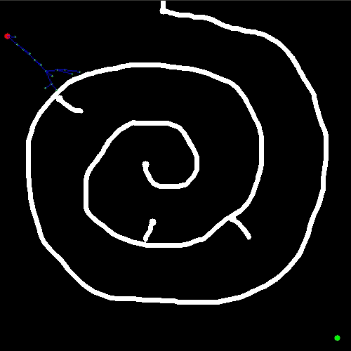
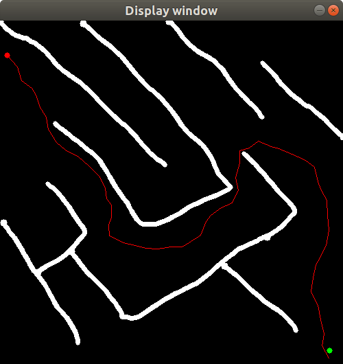

# Anytime-RRT 

Please refer to a seperate [README.d](anytimerrt/README.md) to understand the *anytimeRRT* ros package.

# RRT & RRT*

## Building from Source

### Dependencies

The *ros-rrt* package depends only on the linear algebra library [Eigen].

	sudo apt-get install libeigen3-dev

The other packages depend additionally on the [ROS] standard installation (*roscpp* and *nav_msgs*).

### Configuration

To configure the project before building please follow the following steps:
* Add package to your catkin workspace.

		cd catkin_ws/src
		git clone https://github.com/raakeshkamal/ros-rrt.git
* Add the path to your **eigen3** library in CMakeLists.txt for both **rrt** and **rrtstar**.

		set(EIGEN3_INCLUDE_DIRS "<path to your eigen3 library>").
* build your package.

		cd ..
		catkin_make
## Usage

Input files are stored in the *maps* folder for both **rrt** and **rrtstar**. The name for the input map file should be given in the  `map.yaml` file in the *maps* folder of the respective packages.

	image: map3.png

Inputs to the *planner*  node can by given by simple editing the  `rrt.launch` or `rrtStar.launch` file in the *launch* folder of the respective packages.

* *map_file* is the absolute path to the  `map.yaml` in the *maps* folder of the current package.

		<arg name="map_file" value="/home/raakesh/Documents/ros-rrt/catkin_ws/src/rrt/maps/map.yaml">

* *startX & startY*  represent the ( x , y ) coordinates of the starting point or the root of the RRT tree.

		<arg name = "startX" value="480" /> <!--  X coordinate of the starting point -->
		<arg name = "startY" value="480" /> <!--  Y coordinate of the starting point -->

* *endX & endY*  represent the ( x , y ) coordinates of the end point or the goal of the RRT algo.

		<arg name = "endX" value="10" /> <!--  X coordinate of the goal -->
		<arg name = "endY" value="10" /> <!--  Y coordinate of the goal -->

* *stepSize* represents the step size to be used for adding new nodes.

		<arg name = "stepSize" value="10.0" /> <!--step size of RRT -->
* *neighbourFactor* is applicable to **RRT***.It represents the radius of search with respect to the step size for the nearby nodes from the new node.For example if *neighbourFactor* is 2.0 the radius of search is *2.0 x stepSize*

		<arg name = "neighbourFactor" value="2.0"/> <!--neighbour Factor for search-->
* *maxIter* represents the maximum number of iterations the RRT algo is supposed to run.

		<arg name = "maxIter" value="10000" /><!--max iterations of the RRT algo-->
* *animate* set this argument to true to visualize the RRT tree.

		<arg name = "animate" value="true" /> <!--set to true to visualize RRT-->

    
    
    		<arg name = "animate" value="false" /> <!--set to true to visualize RRT-->
		
    
 
 similarly for RRT*
 
 
	
 
    

## Launch
Once you have set the required parameters in the launch file of the respective package, run the RRT algo using

	roslaunch rrt rrt.launch
And the RRT* algo using 

    roslaunch rrtstar rrtStar.launch
## Bugs & Feature Requests

Please report bugs and request features using the [Issue Tracker](https://github.com/anybotics/grid_map/issues).

[ROS]: http://www.ros.org
[RViz]: http://wiki.ros.org/rviz
[Eigen]: http://eigen.tuxfamily.org
[OpenCV]: http://opencv.org/
[nav_msgs/OccupancyGrid]: http://docs.ros.org/api/nav_msgs/html/msg/OccupancyGrid.html

