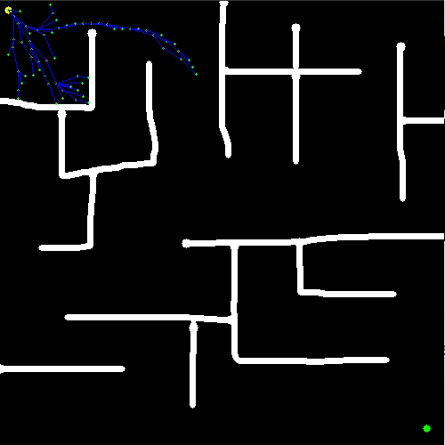

# ANYTIME-RRT
## Concept

The implementation provided in this ROS package is purely based on my own interpertation of [Karaman et al., 2011](https://ttic.edu/ripl/publications/karaman11.pdf). Please read the research to get a better understanding of the *Commited Trajectory* and *Branch and Bound* concepts. 

## Building from Source

### Dependencies

Please follow the original readme for the project to setup dependencies.

### Configuration

Please follow the original readme for the project to setup dependencies.

## Usage

Input files are stored in the *maps* folder. The name for the input map file should be given in the  `map.yaml` file in the *maps* folder of the respective packages.

	image: map3.png

Inputs to the *planner*  node can by given by simple editing the  `anytimeRRT.launch` file in the *launch* folder of the respective packages.

* *map_file* is the absolute path to the  `map.yaml` in the *maps* folder of the current package.

		<arg name="map_file" value="/home/raakesh/Documents/ros-rrt/catkin_ws/src/rrt/maps/map.yaml">

* *startX & startY*  represent the ( x , y ) coordinates of the starting point or the root of the RRT tree.

		<arg name = "startX" value="480" /> <!--  X coordinate of the starting point -->
		<arg name = "startY" value="480" /> <!--  Y coordinate of the starting point -->

* *endX & endY*  represent the ( x , y ) coordinates of the end point or the goal of the RRT algo.

		<arg name = "endX" value="10" /> <!--  X coordinate of the goal -->
		<arg name = "endY" value="10" /> <!--  Y coordinate of the goal -->

* *stepSize* represents the step size to be used for adding new nodes.

		<arg name = "stepSize" value="10.0" /> <!--step size of RRT -->
* *algoSpeed* represents the relative speed of the **RRT*** algorithm with respect to the motion of the robot. It the number of iterations the **RRT*** algo runs for every step of the robot.

        <arg name = "algoSpeed" value="100" /> <!--algo speed of RRT -->
* *maxRuns* is the total number of **RRT*** algorithm runs. 

        <arg name = "maxRuns" value="4" /> <!--maximum number of RRT runs -->
* *costToGoFactor* is a part of the branch and bound algorithm. Higher *costToGoFactor* biases the **RRT*** algo to look for new nodes to add in and around the end point of the robot.

        <arg name = "costToGoFactor" value="3.0"/> <!--cost to go factor for the branch and bound function-->
* *neighbourFactor* represents the radius of search with respect to the step size for the nearby nodes from the new node.For example if *neighbourFactor* is 2.0 the radius of search is *2.0 x stepSize*

		<arg name = "neighbourFactor" value="2.0"/> <!--neighbour Factor for search-->
* *maxIter* represents the maximum number of iterations the RRT algo is supposed to run.

		<arg name = "maxIter" value="10000" /><!--max iterations of the RRT algo-->

## Launch
Once you have set the required parameters in the launch file of the respective package, run the anytime-RRT algo using

	roslaunch anytimerrt anytimeRRT.launch

## Bugs & Feature Requests

Please report bugs and request features using the [Issue Tracker](https://github.com/anybotics/grid_map/issues).

[ROS]: http://www.ros.org
[RViz]: http://wiki.ros.org/rviz
[Eigen]: http://eigen.tuxfamily.org
[OpenCV]: http://opencv.org/
[nav_msgs/OccupancyGrid]: http://docs.ros.org/api/nav_msgs/html/msg/OccupancyGrid.html
