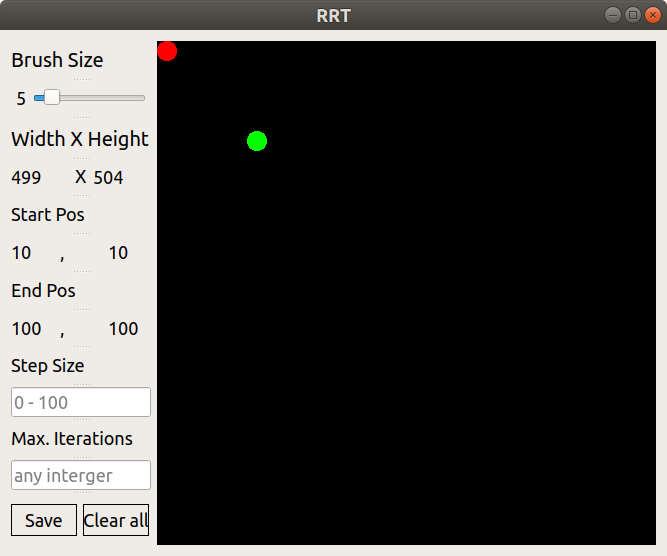
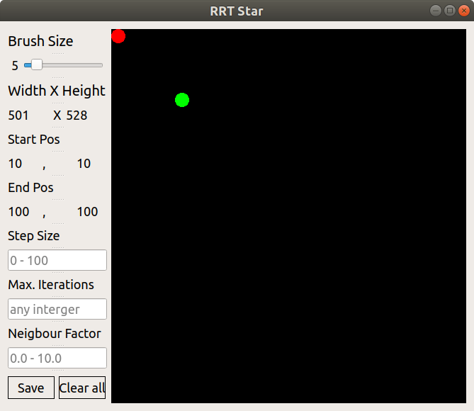
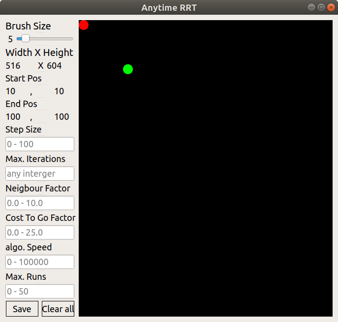
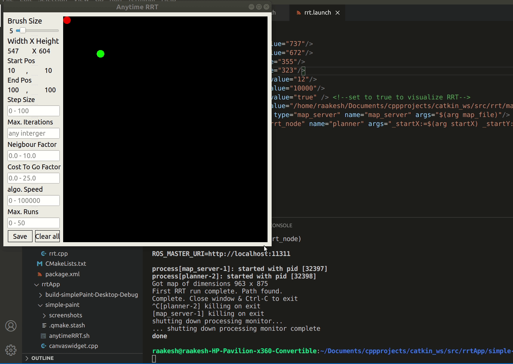
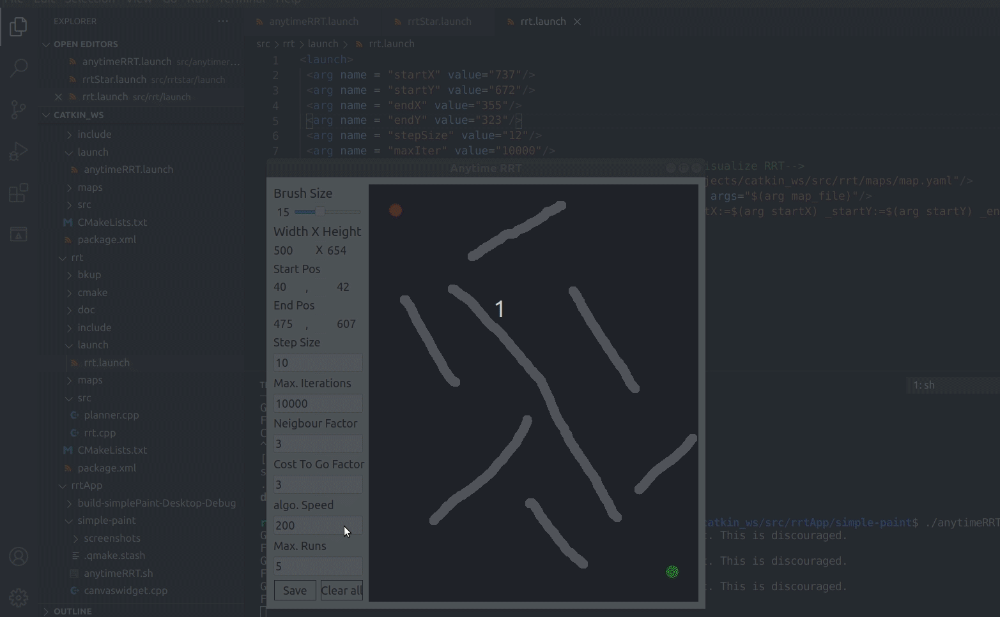

# RRT GUI

This is a simple GUI for accessing and working with the other three RRT packages. Its build using Qt5.x framework for cross platform GUI building using C++.

## Building from Source

### Dependencies

Please follow the README.md for the other three RRT packages and install their respective dependencies. The GUI application need QT5.x package installed for it to work.It the package using

	sudo apt-get install qt5-default

For further info please follow [link](https://wiki.qt.io/Install_Qt_5_on_Ubuntu)

### Configuration

The GUI application and ROS packages are completely independent and are linked together by shell scripts namely **rrt.sh**, **rrtStar.sh**, **anytimeRRT.sh**.

	For the application to work all the packages and GUI application has to be in the same catkin workspace.

* Move to the GUI application folder

		cd rrtApp/simple-paint
* Run the follow commands to compile the GUI app

		make distclean
		qmake
		qmake simplePaint.pro
		make
* Give executable permission to the shell scripts

		sudo chmod 755 rrt.sh
		sudo chmod 755 rrtStar.sh
		sudo chmod 755 anytimeRRT.sh
## Usage

Run the shell script for the package that you want to work with. For example to run rrt package use
		
	cd rrtApp/simple-paint
	./rrt.sh

If your **roscore** is running you will be greeted with the window below

Similarly for **./rrtStar.sh** and **./anytimeRRT.sh**

### Inputs

* Resize the window to change the size of the input image to the RRT algo. 

		Warning : The minimum height for the input image is restricted to the height of the input window panel

* The red and green pointer represent the start and end positional inputs for the RRT algo respectively. Move the pointer in the image to change the start and end position.

		Warning : Move the pointers slowly as the GUI fails to respond to rapid mouse movements

* Fill the input parameters as shown in the respective GUI windows.

		Info : Stick to the limits mentioned in the input windows. Please refer to the package readme files for clarity on the parameters

* Paint on the canvas using mouse inputs and adjust **Brush size** if needed.
* Click **Clear All** to reset the painter canvas and create a fresh drawing.

* Click **Save** to save the canvas image and feed it as input to the RRT algo. 

		Warning : Add the appropriate extension while saving the file.
		Info : After a successful save the window will close and the ROS node starts running automatically.

## Bugs & Feature Requests

Please report bugs and request features using the [Issue Tracker](https://github.com/anybotics/grid_map/issues).

[ROS]: http://www.ros.org
[RViz]: http://wiki.ros.org/rviz
[Eigen]: http://eigen.tuxfamily.org
[OpenCV]: http://opencv.org/
[nav_msgs/OccupancyGrid]: http://docs.ros.org/api/nav_msgs/html/msg/OccupancyGrid.html

